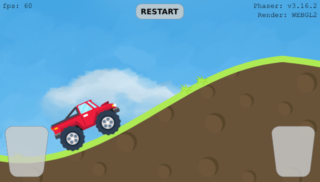

# Phaser 3 + Matter.js example

## Car on a curved terrain crosses a bridge

Build with Phaser 3 using the [typescript phaser-project-template](https://github.com/yandeu/phaser-project-template#readme)

## Play

[Play the game](https://s3.eu-central-1.amazonaws.com/phaser3-typescript/car-on-curved-tarrain/index.html)

## Features

- PWA
- Using WebGL 2

## About

To build this example I used Phaser 3 with the physics engine Matter.js.
To make Matter work, it needs two additional libraries, **poly-decomp** and **pathseg**.

Reading the source code of some classes (especially [Body](http://brm.io/matter-js/docs/files/src_body_Body.js.html#l436), [Bodies](http://brm.io/matter-js/docs/files/src_factory_Bodies.js.html#l102) and [Composites](http://brm.io/matter-js/docs/files/src_factory_Composites.js.html#l230)) of Matter and the [Phaser3-docs](https://photonstorm.github.io/phaser3-docs/Phaser.Physics.Matter.html) helped a lot.

The mainScene takes a while to start and to restart. This is because I use [Matter.Svg.pathToVertices](http://brm.io/matter-js/docs/classes/Svg.html) to transform a SVG Path to an array of vectors at runtime. In a production game, I probably would only include the array of vectors in the game.

## Credits

https://opengameart.org/content/free-off-road-racing-truck
https://opengameart.org/content/monstertruck
https://opengameart.org/content/sky-backdrop

## License

The MIT License (MIT) 2019 - [Yannick Deubel](https://github.com/yandeu). Please have a look at the [LICENSE](LICENSE) for more details.
